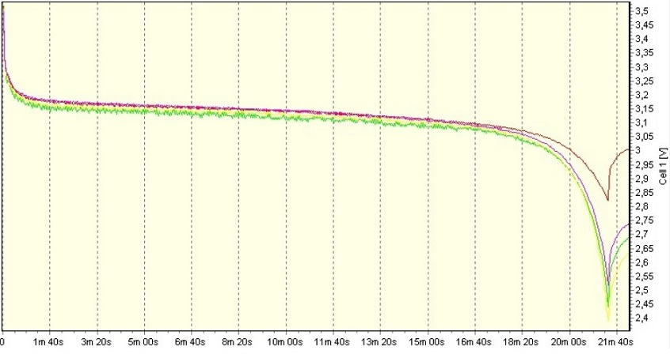
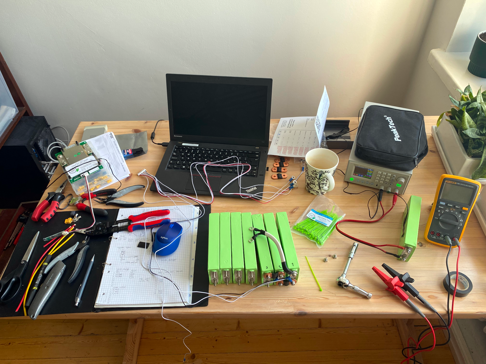

# Campsite power setup

Cell discharge curve from GWL Power product specs. Note how flat and linear the "power" band is.
BMS needs to measure the voltage accurately as possible. 
Overkill solar measures the cells within 0,0002 volts which is adequate for the purpose.

After the voltage drops below 3 volts per cell, the battery is considered to be empty.
BMS protects individual cells and disconnects the pack when a single cell reaches this limit.
In the assembled pack, number 2 is the worst performing cell hitting the triggering the load disconnect conditions
first. 

Initial charge is done individually with each cell. Proposed loading current is 0.5C and the target voltage for the 
first charge is 3,8V. Consecutive charges can be done with 1C and to 3,65V per cell.
Initial charge takes around 2h for each cell, so be prepared to do this all day.

Instagram done! Pack is ready for first trials in summer cottage. The results were good, but the portability was not 
there yet. The next phase is to build a strong case with fixed mounting for USB A and C chargers.

## Bill of materials

| Cost item                                                                                                                        | Price             |
|----------------------------------------------------------------------------------------------------------------------------------|-------------------|
| RD6024W 60V 24A DC power supply unit (VAT 0%)                                                                                    | 84,34e            |
| RD6024W 60V 24A Step-down converter with case (VAT 0%)                                                                           | 164,47e           |
| RD6024W import taxes 24%                                                                                                         | 59,71e            |
| [GWL LiFePO4 20H 3,7V cell](https://shop.gwl.eu/LiFePO4-cells-3-2-V/LiFePO4-High-Power-Cell-3-2V-20Ah-Alu-case-CE.html?cur=1) x8 | 301,44e           |
| GWL Power terminals x7                                                                                                           | 34,86e            |
| GWL ADR shipping (FedEx/TNT sucks)                                                                                               | 61,31e            |
| [Overkill BMS](https://overkillsolar.com/product/8s-bms-100a-lifepo4-m6-threaded/)                                               | 161.53e (164,50$) |
| Misc low power connectors                                                                                                        | 23,49e            |
| Misc high power connectors and insulation tape                                                                                   | 47,70e            |
| Misc tools                                                                                                                       | 64,69e            |
| DC cabels                                                                                                                        | 20,40e            |
| Brightsolar 12V/24V USB-A charger and volts display                                                                              | 19,90e            |
| [Peli protector case](https://www.amazon.de/-/en/gp/product/B000M463F0/)                                                         | 144,42€           |
| Aluminium T-bar, 1m                                                                                                              | 7,45€             |
| Aluminium U-bar, 1m                                                                                                              | 6,25€             |
| Aluminium Sheet, 1,5mm                                                                                                           | 18,15€            |
| Rivet gun                                                                                                                        | 34,95€            |
| Rivets, assorted set                                                                                                             | 18,90€            |
| [USB-C PD charger, 24V](https://www.amazon.de/gp/product/B09YPZCN3V/)                                                            | 40€               |
| [Switches](https://www.amazon.de/gp/product/B07JNRH3NS/)                                                                         | 14€               |
| **Total**                                                                                                                        | **1308,88e**      |

## Solar extension
| Item                                                                                                                                              | Price      | Purpose                |
|---------------------------------------------------------------------------------------------------------------------------------------------------|------------|------------------------|
| [EVI 200 Fold *2](https://www.verkkokauppa.com/fi/product/864451/EVI-200-Fold-taitettava-aurinkopaneeli-200-W)                                    | 2* 175,00€ | Foldable 200W panel    |
| [Victron SmartSolar MPPT 100V/20A](https://esconet.fi/shop/scc075010060r-victron-smartsolar-mppt-75v-10a-12-24-v-lataussaadin-bluetoothilla-7574) | 96,42€     | MPPT controller        |
| Misc kables and connectors                                                                                                                        | 6,57€      | Wood-joy               |

## Upcoming possible additions
| Item                                                                                                                        | Price   | Purpose                |
|-----------------------------------------------------------------------------------------------------------------------------|---------|------------------------|
| [iCharger X8](https://www.stefansliposhop.de/en/chargers-power-supplys/junsi/junsi-icharger-x8-charger-1100w-8s::2053.html) | 179,90€ | Low flying helicopters |

